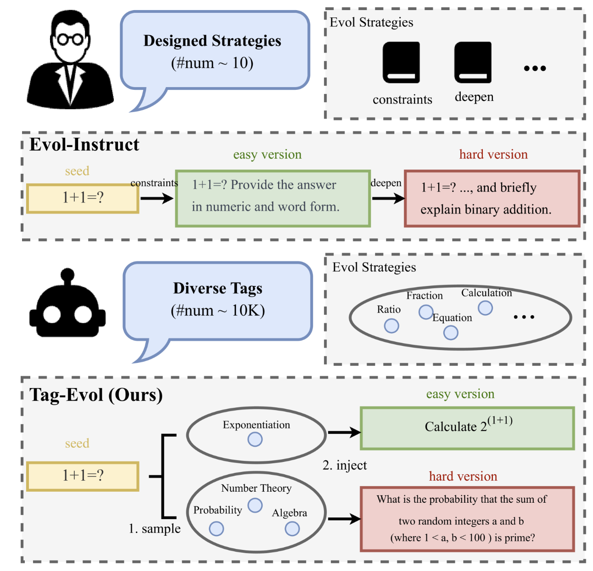

# Tag-Evol: Achieving Efficient Instruction Evolving via Tag Injection
Implementation of ACL 2025 Finding paper [Tag-Evol: Achieving Efficient Instruction Evolving via Tag Injection](https://arxiv.org/html/2505.24165v1).

<div align="center">

</div>

## A minimal implementation of Tag-Evol

<div align="center">

</div>

## Run the following code to perform TagEvol data evolution.

```bash
task_type="code" # code, common, math-all
cd TagEvol-${task_type}/tag_evol
bash shell/run.sh
```


## Citation
If you find this work is useful for your research, please cite our paper:

```
@article{wang2025tag,
  title={Tag-Evol: Achieving Efficient Instruction Evolving via Tag Injection},
  author={Wang, Yixuan and Zhou, Shiqi and Guo, Chuanzhe and Zhu, Qingfu},
  journal={arXiv preprint arXiv:2505.24165},
  year={2025}
}
```